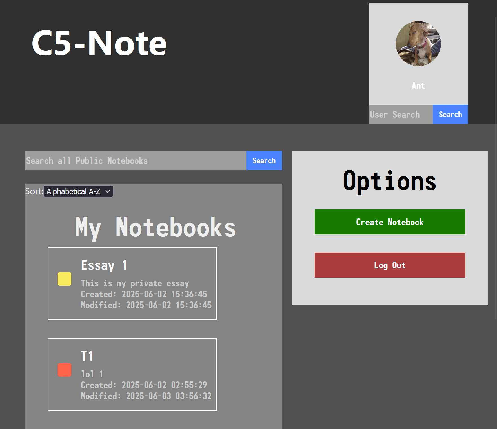
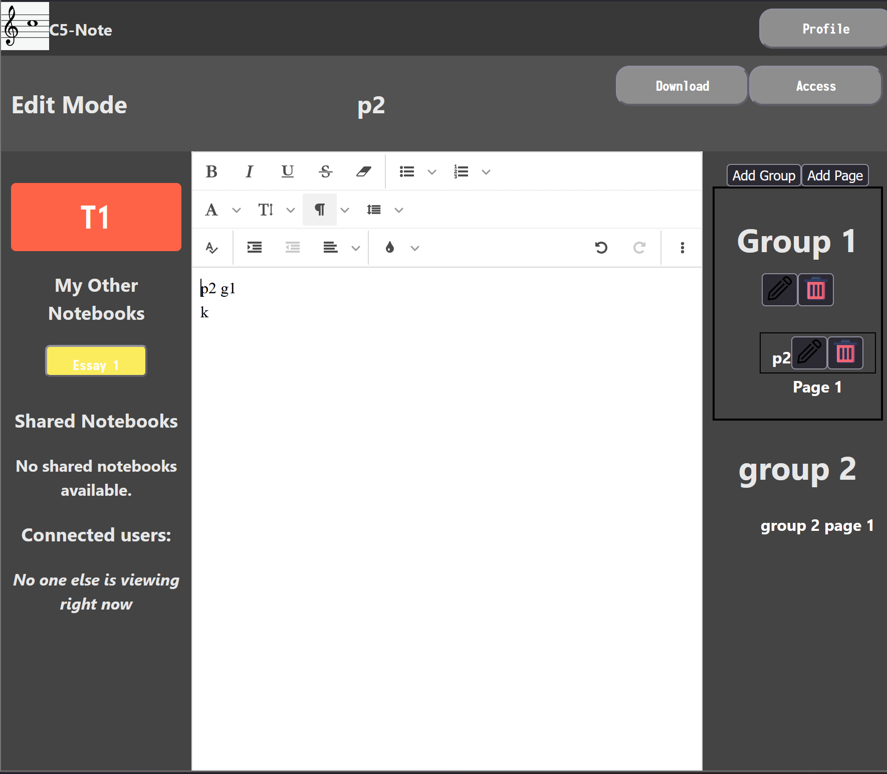
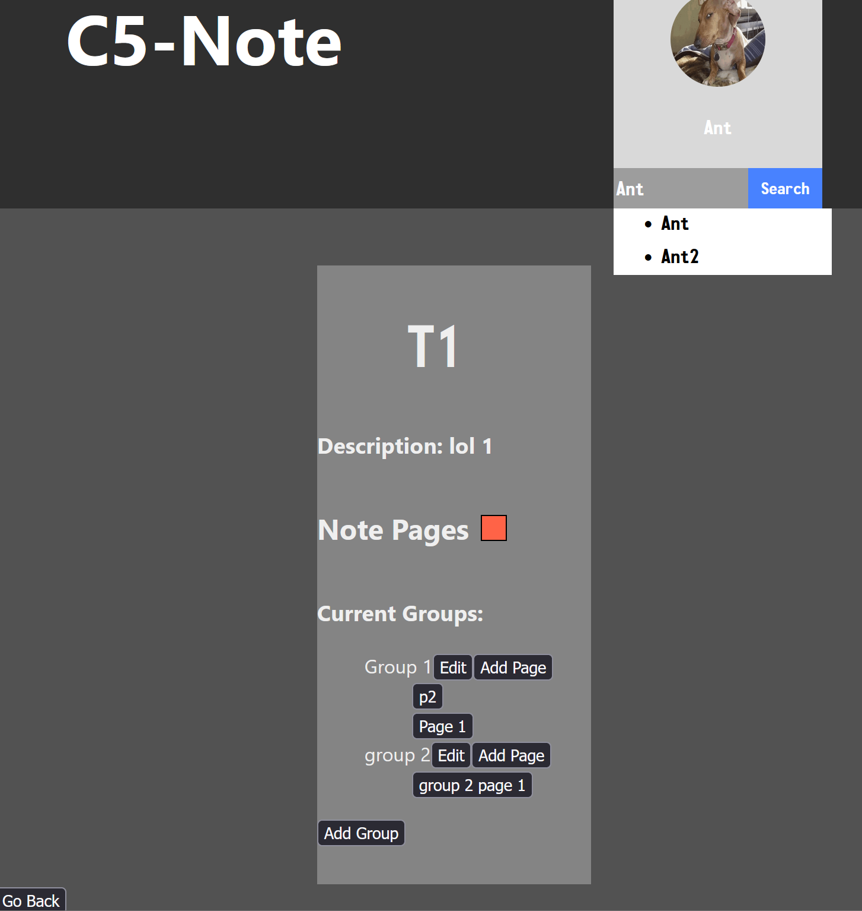
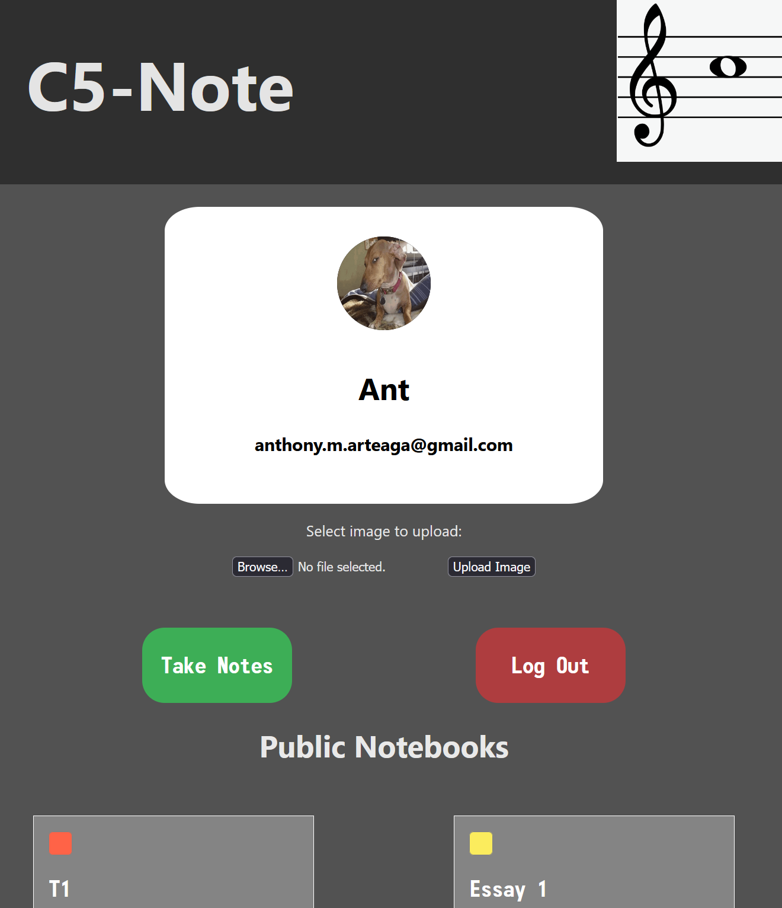

# C5-Note

C5-Note is a full-stack note-taking web app powered by:

- **Frontend**: React + Vite
- **Backend**: PHP
- **Database**: MySQL

---

## Features
 
- **Editor** — Rich text editing with fonts, sizes, bold/italic/underline, image embedding, and more, similar to Google Docs.
 
- **Notebooks & Documents** — Create notebooks to group documents, then drag and rearrange both notebooks and pages however you like.
 
- **Sharing & Privacy** — Share notebooks with others for view-only or edit access, or toggle between public and private visibility.
 
- **Discover** — Search for users on the platform and browse their public notebooks and documents.
 
- **Export** — Export your documents in multiple formats.
 
- **Account Management** — Forgot username and reset password flows included.

## Requirements

Make sure you have the following installed on your system:

- [Node.js](https://nodejs.org/) (for React/Vite)
- [PHP](https://www.php.net/downloads) (recommended: v8.x)
- [MySQL Server](https://dev.mysql.com/downloads/mysql/)
- [Composer](https://getcomposer.org/) (only needed if you're using PHPMailer or other PHP libraries)

---

## How to run

Start react front end
```
cd C5-Note
npm install
npm run dev
```

Start PHP back end
```
cd C5-Note
composer install

cd src
php -S localhost:8000
```

## Screenshots

<table>
  <tr>
    <td align="center"><br><b>Notebooks</b></td>
    <td align="center"><br><b>Pages & Groups</b></td>
  </tr>
  <tr>
    <td align="center"><br><b>Document Editing</b></td>
    <td align="center"><br><b>Public Notebooks</b></td>
  </tr>
</table>
